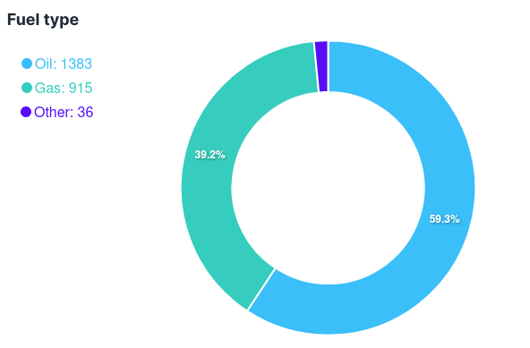

# EcocalorAnalysis
Application WEB interactive mettant à disposition une interface permettant de visualiser un maximum d’information de afin d’en apprendre plus sur les possibilités d’extension de l’entreprise. Plusieurs vue seront proposées dont une vue cartographique permettant d’en apprendre plus sur l'implantation géographique de l’entreprise.

#### Membres de l'équipe
- **Thibaut Michaud** (thibaut.michaud@hes-so.ch)
- **Romain Peretti** (romain.peretti@hes-so.ch)

## Intention/objectif
Exploiter les informations récoltées par l’application CRM/ERP lors des 3 dernières années et fournir une représentation visuelle facilement compréhensible et utilisable afin proposer des statistiques pertinentes sur le parc d’installation et les interventions réalisée ainsi qu’une visualisation permettant de comprendre d’où provient le chiffre d’affaire.

## Source de données
Base de donnée (SQL) extraite du système de base de données de l’application CRM/ERP de l’entreprise de chauffage Ecocalor (HFSQL)

## Concepts de visualisation de l'information appliqués

### Couleurs et typographie
L'utilisation de TailwindCSS et DaisyUI permet de baser le design de l'application sur des classes CSS pré-définies et donc s'assurer que les couleurs et la typographie utilisées sont cohérentes et uniformes.

Le couleurs utilisées sont celles du thème light de DaisyUI.


La police de caractère utilisée est celle par défaut de TailwindCSS.
Il s'agit de la police `Sans` qui est une police de caractère moderne et légère qui est facile à lire.


### Choix des représentation
#### Analyse du parc d'installation
##### Cartographie
La cartographie permet de visualiser l'implantation géographique des installations de l'entreprise. Les installations sont représentées par des marqueurs. Afin d'améliorer la lisibilité, les marqueurs sont regroupés par cluster. Un cluster est un marqueur représentant un groupe de marqueurs. Le nombre d'installations dans un cluster est affiché à l'intérieur du cluster mais également avec la couleur et la taille du cluster. Plus le cluster est gros et plus il y a d'installations dans le cluster. Plus le cluster est rouge et plus il y a d'installations dans le cluster.


##### Chiffres clés
Des chiffres clés sont affichés afin de connaître le nombre d'appareils, le nombre d'installations et finalement le nombre d'appareils possédant un contrat d'entretien. Nous avons choisi d'afficher ces chiffres clés afin de permettre à l'utilisateur de se faire une idée de l'importance du parc d'installation de l'entreprise en un coup d'oeil.


##### Diagramme en barres
Un premier diagramme en barres permet de connaître le nombre d'installation par marque d'appareil. Nous avons choisi de représenter ce diagramme en barres horizontal afin de pouvoir comparer les marques entre elles et il préconisé d'utiliser des bar horizontal lorsqu'il y a plus de 10 catégories à comparer.


Un second diagramme en barres (vertical) permet de connaître la distribution de la puissance des appareils.


##### Diagramme en donut
Un diagramme en donut permet de connaître le type de combustible utilisé par les appareils. Nous avons choisi de représenter d'utiliser un diagramme en donut car il n'y a que 3 catégories à comparer.



##### Intervalle avec histogramme
Nous avons ajouté un intervalle avec histogramme afin de connaître la distibution de l'année d'installation et de la puissances des appareils lors de l'application de filtres. Cela permet de guider l'utilisateur dans la sélection des filtres.


## Installation et utilisation
### Prérequis
- au minimum `npm@8.19.2`

### Installation des dépendances
**Backend**
```bash
pip install -r requirements.txt
```

**Frontend**
```bash
npm install
```

### Lancement de l'application
**Backend** dans un premier terminal
```bash
python app.py
```

**Frontend** dans un second terminal
```bash
npm run dev
```

**Accéder à l'application** dans un navigateur web:
à l'adresse http://localhost:5173
